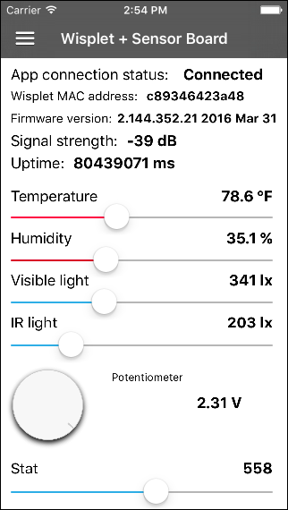
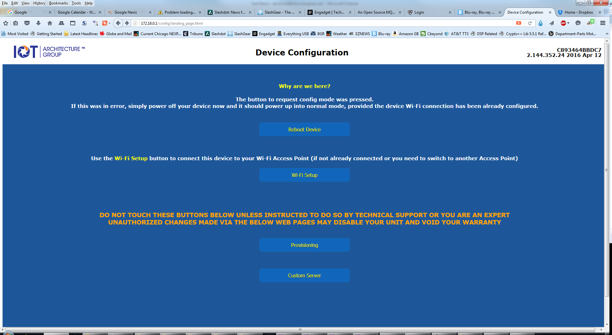
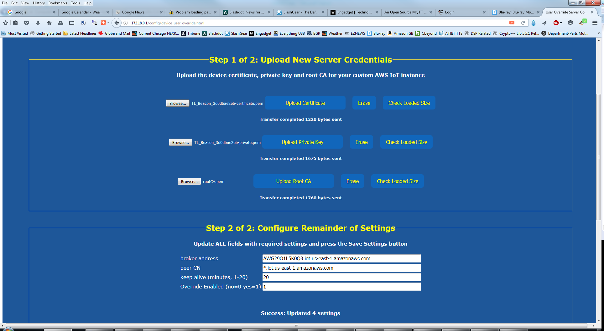

# Wisplet S2W IoT Eval Kit

The **Wisplet S2W (Serial-to-WiFi) Eval Kit** comes with not only the **Wisplet IoT connectivity board**, but also with a **sensor board**, attached via ribbon cable.  This sensor board is an example of a product that you might want to integrate with a Wisplet to build a connected product.

This sample app will connect to the AWS IoT MQTT broker and will show you values from the six components of the sensor board:

- Temperature sensor
- Humidity sensor
- Visible light sensor
- Infrared light sensor
- Potentiometer (the black knob—or more accurately, the knob post)
- ‘Stat’ display, a 3-digit LED

These six parameters will send their values up to the MQTT broker periodically.  The first five parameters are **read-only**, while the last (the ‘Stat’ display) is **read/write**, and allows you to model a **control message**: a message that sends data down to the sensor board rather than just reading data from it.  In a real connected product, instead of simply writing to an LED this could instead do something more practical, like unlocking a door.

The app will let you see values of all six parameters, and will let you send values down to the ‘Stat’ display by sliding and releasing an on-screen slider.

You can watch the MQTT messages that pass between the Wisplet Eval Kit and the AWS IoT broker in the Xcode console while running the app in the iOS-device simulator (or on a real device cabled-up to your Mac).

## Getting Started

At a high level, the steps you’ll have to go through to run the app in conjunction with your Wisplet Eval Kit are:

- Create your own AWS instance with AWS IoT.
- Create a ‘Thing’ to represent your Wisplet Eval Kit, in the AWS console, and generate a certificate for it.
- Load your certificate files (private key file and certificate authority file) on your Wisplet, by connecting to it while it is running as a WiFi access point.  You will connect to it as an access point, then upload the two files using your computer's web browser.
- Attach your Wisplet to your local WiFi access point by choosing the appropriate WiFi access point when the Wisplet is scanning for visible WiFi networks, and then entering the passcode for your WiFi network.
- Create an **unauthenticated user pool**, to allow the iOS app to connect without require loading certs in the app too (although you can install certs in an iOS app if you prefer that to using an unauthorized user pool).
- Add your AWS instance’s region, Cognito identity pool id, and AWS IoT policy name to **Constants.swift**, and add your Wisplet’s MAC address to **Constants.h**

When building the sample iOS app, remember that the AWS IoT SDK for iOS gets installed via CocoaPods, so you will need to run **pod install** after downloading the code.  See the [AWS SDK iOS Sample](https://github.com/awslabs/aws-sdk-ios-samples/tree/master/IoT-Sample/Swift) for more detailed instructions.  You will also need to launch from the **Wisplet AWS Client.xcworkspace** file instead of the **.xcodeproj** in Xcode.

## Connecting Wisplet to your AWS Instance
The Wisplet comes pre-configured to connect to the IoT Architecture Group's AWS instance.  To have it connect to your own AWS instance, you will need to upload your AWS certificates to it.

Power up the Wisplet eval kit and press-and-hold the WiFi config button for five seconds.  This will make the Wisplet operate in Access Point mode (it will operate as an access point to which you can connect from your laptop).

Then connect your computer to the WiFi Access Point the Wisplet presents.  This will be named 'IoTAG-...' where the last part is the MAC address of your Wisplet.

Once connected, load the config web page by entering URL http://device.config or http://172.18.0.1

If you have not already done so, this is the page you will use to configure the Wisplet to attach to your home or office WiFi network when the Wisplet is NOT running in Access Point Mode.  Choose 'Wi-Fi Setup' to do that if you have not already done so.  The Wisplet will restart, stop running in Access Point Mode, and will attach as a WiFi client to your WiFi network, and attempt to connect to AWS.

By default--as mentioned above--it will be connecting to the IoT Architecture Group's AWS instance.

To configure to attach to YOUR AWS instance, press-and-hold the WiFi config button on the Wisplet kit again, and again connect to the Access Point the Wisplet presents at URL http://device.config or http://172.18.0.1

This time, choose 'Custom Server' (the button at the bottom of the page).

You will then see this page:

You will need the certificate, the private key, and the root CA files for your AWS instance.  Navigate to these files each, after pressing the appropriate button, and let your browser upload them to the Wisplet.  It is very important to have no extra white-space after the content of those file.  Specifically, after the end of the last line of text, you should have only a CR/LF.  In other words, when viewed in a text editor, your cursor should be at the start of the FIRST EMPTY LINE after the last line of text, if you scroll to the bottom of the key or cert file.

Fill in the Broker Address and Peer CN fields to match your AWS instance.  Set Keep-Alive to 20 minutes.

Set the override value to 0 to connect to YOUR AWS instance.

'Override' means 'override the custom cert and AWS instance configuration' and revert back (temporarily) to the IoT Architecture Group AWS instance.  So set override to 0 to point to your own instance.

Should you need to point the Wisplet back to the IoT Architecture Group's instance (for example, to try one of the IoT Architecture Group's other examples, or to push new IoT rulesets to the Wisplet) you can temporarily do so by setting Override to 1 in this configuration page.  Doing so will NOT delete the config files and settings that you set for your own AWS instance, so you can switch back and forth between instances relatively easily, without needing to perform the cumbersome cert/key file uploads each time.

## Code overview
The heart of the app is essentially three classes:

- **AWSConnection.swift**, which creates a certificate for the app to connect to your unauthenticated user pool and connects to the AWS IoT MQTT broker of your AWS instance.
- **WispletDevice.m**, which encapsulates all the AWS IoT SDK for iOS MQTT calls, to subscribe to all MQTT message topics for which you wish to receive messages, and to publish MQTT messages that will reach the Wisplet (which has automatically subscribed to the necessary topics). This class also parses out MQTT payloads.
- **SensorBoardViewController.m**, which gets notified when any MQTT messages come in and displays the current values to the user.  It also allows the user to send an update command to the one read/write parameter (the ‘Stat’ parameter) by sliding the bottom slider and releasing.  This allows you to see how to send a control message to a Wisplet.

#### AWSConnection.swift
This is essentially a simplified version of the AWS Iot SDK demo for iOS.  At the time of this writing, that demo app is only available from AWS’s github as Swift (not Objective-C).

As the connection to AWS IoT’s MQTT broker is established, **AWSConnection.swift** calls in to a method on the **AppDelegate** class, which stores the string representing the connection state.  **AppDelegate** is (in addition to its normal function) essentially a delegate that receives these notifications, but is not technically implemented as a proper delegate implementing a protocol simply due to the fact that the **AWSConnection** class is Swift rather than Objective-C.

However, the **AppDelegate** does define a protocol for another class to implement so that that other class (in this case, **SensorBoardViewController.m**) also gets notified when the app’s MQTT connection state changes.  And **AppDelegate** stores the most recent connection state string so that **SensorBoardViewController** can see the most recent state.  This is useful in cases where the app user navigates to a different screen in the app then returns to **SensorBoardViewController**.

#### WispletDevice.h/.m
**WispletDevice.h** defines another protocol, which in the app is implemented in **SensorBoardViewController**.  **WispletDevice** does several things:

- Represents the single Wisplet eval kit device (which you identify by MAC address in Constants.h), including having some helper contained classes to represent the eval kit’s sensor board and the sensor board’s 6 sensor parameters
- Subscribes to MQTT messages from that Wisplet eval kit device
- Makes the calls to actually publish MQTT messages to the the Wisplet eval kit device.

**WispletDevice.m** will display the MQTT topic and payload of any messages it sends to the Wisplet or receives from the Wisplet, in the Xcode console.

Sending an MQTT message via AWS IoT’s SDK is straightforward.

Receiving MQTT messages is slightly more complicated. You must subscribe and provide a block of code to be executed on receipt of any messages that match the topic string to which you subscribed.  Within that block, you can access the payload of the MQTT message as a string, which you can easily convert to a JSON object and then an NSDictionary.  You cannot however access the topic string, but since you must provide a separate code block for each message type to which you subscribe, your code block can know what the topic string pattern was to which you subscribed.

#### SensorBoardViewController.h/m
When a message is received and the associated block of your code is executed, the payload will be parsed (if the message had a payload) and then the delegate implementing the protocol defined in **WispletDevice.h** will be notified.  In our case this is **SensorBoardViewController**.  **SensorBoardViewController** will access the main thread and update the UI to display the new values for all sensors.

**SensorBoardViewController** contains a substantial amount of code that is unrelated to AWS Iot, but rather that works with two UI component libraries.  One implements a nicer slider control, and one implements a circular knob control.  These were included in this sample app as a convenience for developers who may wish to modify the sample app as they integrate the Wisplet with their own hardware product.

The sample app also includes a sidebar menu implementation, **SWRevealViewController**, which is not necessary for a simple demo of how to use AWS IoT’s SDK, but again will help developers who wish to experiment with the sample app and who will need additional screens.  By using the **SWRevealViewController**, developers can more quickly add additional screens.  The current sample app includes only two screens (**SensorBoardViewController** and **AboutViewController**) but by following the example of those two screens, developers should be able to figure out how to add additional screens.

### Things to keep in mind

- Avoid sending MQTT messages too quickly.  In particular, allow a bit of time between subscribing to a message topic and then sending a message that generates a response on a topic to which you have subscribed.  The sample app starts an NSTimer to wait between subscribing to all relevant topics and sending the message that tells the Wisplet to send a status update immediately.  Without this timer delay, your app can miss the status update response because AWS’s MQTT broker may not have completed your subscription action before the status update message is sent.
- When passing updates from WispletDevice.m or AWSConnection.swift to SensorBoardViewController.m, ensure that you always perform your UI updates in the main thread, otherwise they may not appear until the user forces a UI update by touching the ‘Stat’ slider at the bottom of the screen.
- Ensure that you register your delegate class as the delegate in your ViewWillAppear or ViewDidAppear methods.  When transitioning between screens in your app, at times a new instance of SensorBoardViewController will be created.  If you do not register that NEW instance, updates from AWSConnection.swift and WispletDevice.m will be delivered to the old instance, which no longer represents the visible screen, and as a result no UI updates will occur.

## Wisplet MQTT messages
The core of the Wisplet device is its ability to send **status update** messages at pre-configured intervals to report values of various user-definable parameters, and to send **alert** messages when values on specified parameters exceed defined thresholds.

For most purposes, receiving status update messages from a Wislet every minute is adequate, but for a user of a mobile or web app who is watching a screen in the app displaying the current status of the connected device, it is often better to get more timely updates so a user is not looking at stale data until the next automatic status update.  

To accomplish this, an app (or any MQTT client) can publish a **status update now** request message.  The WIsplet will respond first with an ack message, then with a status update message.

Other messages that the Wisplet supports (and that are demonstrated in the sample iOS app) include the ability to request that the Wisplet report its Wisplet **firmware version**.  The Wisplet will respond with an ack message, and then with a message containing the firmware version.

The Wisplet can also receive a message informing it to download and install a new firmware binary (this is not demonstrated in this app).

